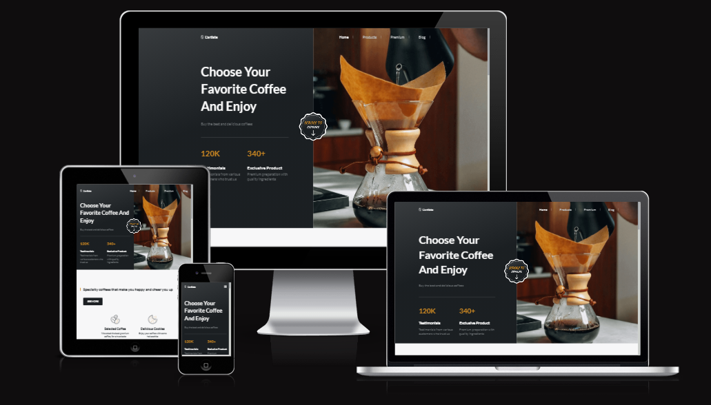

أكيد يا عمري! سأعد لك وصفًا مشابهًا بنفس التنسيق وباللغة الإنجليزية لمشروع **"Coffee Exhibition Website"**. هنا هو الوصف المعدل:

---

# **Coffee Exhibition Website**

**Coffee Exhibition Website** is a visually stunning and fully responsive website designed to showcase coffee exhibitions, events, and coffee-related experiences. Built with HTML, CSS, and JavaScript, this website offers a modern design and interactive features, providing visitors with an immersive experience as they explore the world of coffee.

## **Features**

- ☕ **Event Showcase**: A dedicated section to highlight upcoming coffee exhibitions, events, and festivals. Easily display event details, dates, locations, and more to keep your audience informed.

- 🌍 **Responsive Design**: The website automatically adapts to all screen sizes, ensuring a smooth experience on desktops, tablets, and mobile devices.

- 🎨 **Stylish UI/UX**: A clean, minimalistic design focused on visuals and usability. Interactive elements provide an engaging experience for users while keeping the interface intuitive.

- 🗓️ **Event Calendar**: A custom event calendar to display all upcoming coffee-related events and exhibitions. Visitors can easily navigate and find events by date and location.

- 📬 **Contact Form**: An integrated contact form that allows visitors to get in touch with you for inquiries or event details. The form can be customized as needed.

- ✨ **Smooth Animations**: Subtle animations enhance the overall user experience, making browsing the site feel interactive and dynamic.

- 🔍 **SEO Optimized**: The website structure is designed to be search engine-friendly, helping to increase the visibility of coffee-related events and exhibitions.

## **Technologies Used**

- **HTML5**: For structuring the content of the website.
- **CSS3**: For styling and creating a visually appealing, responsive layout.
- **JavaScript**: For interactivity, such as smooth scrolling, event filtering, and form validation.
- **Bootstrap** (optional): Used for quick prototyping and responsive grid layouts.

## **Installation**

To get started with the **Coffee Exhibition Website**, follow these simple steps:

1. Clone the repository to your local machine:
   ```bash
   git clone https://github.com/Momen9Sarsour/Coffee-Exhibition-Website.git
   ```

2. Navigate to the project directory:
   ```bash
   cd Coffee-Exhibition-Website
   ```

3. Open the `index.html` file in your browser to view the website locally.

4. Optionally, deploy the website to a live server using platforms like GitHub Pages, Netlify, or Vercel.

## **Customization**

You can easily tailor the website to fit your specific exhibition or coffee-related event:

- Update the **event details** in the HTML files to reflect the information about your exhibitions.
- Replace **images** with your own event or exhibition photos. Be sure to update the paths as needed.
- Adjust the **color scheme** in the CSS file to match your branding or event theme.
- Modify the **contact form** to send submissions to your email or server endpoint.

## **Project Images**

Showcase images from your coffee exhibitions or event posters here. You can include high-quality images of past events, coffee cups, brewing equipment, or anything that represents your exhibitions.

- 📸 **Exhibition Image**:
  

> **Note**: Remember to replace the image path with the location of your own images.

## **Live Demo**

View the live demo of the website by clicking the link below:

[Live Demo of Coffee Exhibition Website](https://example.com)

> **Note**: Be sure to replace the link with your actual live demo URL, whether hosted on GitHub Pages, Netlify, or another platform.

## **Contributing**

If you'd like to contribute to the project, feel free to fork the repository and create a pull request for improvements, bug fixes, or new features. All contributions are welcome!

## **License**

This project is open-source and licensed under the **MIT License**. For more details, check the LICENSE file.

---

### **Example Usage**
Whether you're hosting a **coffee exhibition**, organizing a **coffee festival**, or simply looking to promote **coffee-related events**, the **Coffee Exhibition Website** provides an excellent starting point for creating an engaging online experience for coffee enthusiasts.

---

## 👤 About Me

**Momen Sarsour — Computer Systems Engineering**  
📧 Email: **momensarsour5@gmail.com**  
📱 WhatsApp: **+970567077179**
